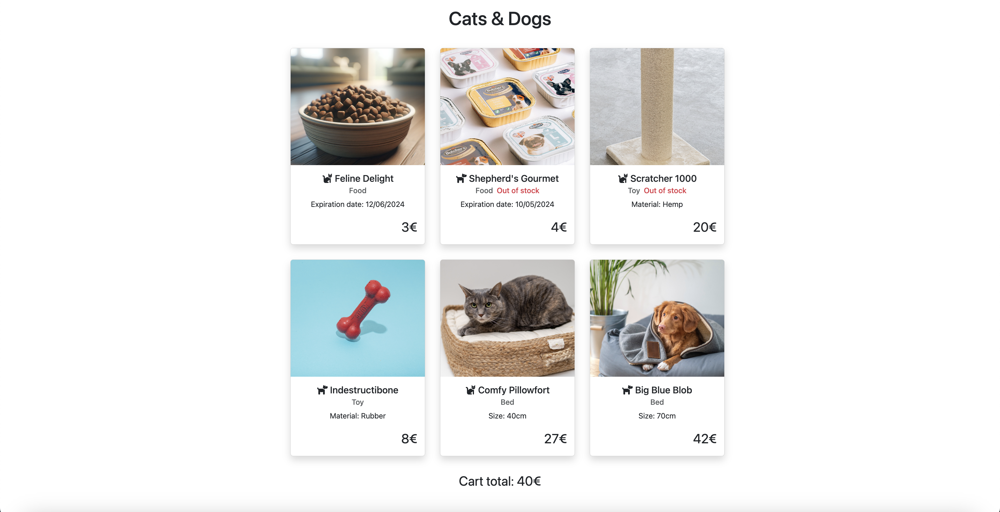

# PHP OOP 2

This project is intented to practice inheritance in php. It is the mockup of an online pet store.  

It features a list of products (represented by product cards) with their relative data that can be one of food, toys, or beds. All three are classes that extend the "product" class and take specific arguments to function.

The products are also categorized by whether they are designed for cats or for dogs, and their cards feature an icon of one or the other. The cards also inform the user if an item is out of stock.

Users of the website can become "Registered Users" (a class that extends the User class) and gain a 20% discount on the total price of the items in their cart, calculated at the bottom of the page.  
The user is also informed if their card is expired or otherwise invalid.